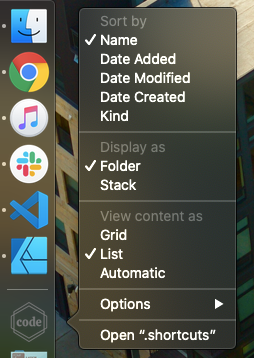

# dockspace

A MacOS tool that creates custom shortcuts for all your VS Code workspaces.


```sh
$ dockspace workspaces_directory svg_icon shortcuts_directory
```

## How to get it

1. Download the `dockspace.sh` script from this repo, and mark it executable.

```sh
# download
$ curl -fsSL https://raw.githubusercontent.com/tomprogers/dockspace/master/src/dockspace.sh > ./dockspace.sh
# make it executable
$ chmod ugo+x ./dockspace.sh
```

You can source the file to register the `dockspace` function, or invoke it by file path.


2. Install dependencies

dockspace uses about a dozen CLI tools, some of which are exclusive to MacOS. Two are not standard, but can be installed using homebrew:
- `jq` : used to parse workspace files
- `librsvg` : used to convert SVGs into rasters

```sh
$ brew install jq librsvg
```

For the curious: the Mac-specific tools are all related to setting file icons, which are stored in Mac's resource fork. The main ones are `DeRez`, `Rez`, `SetFile`, and `sips`.

Future versions of dockspace will be published via homebrew, and will install these dependencies for you.


## How to use it

dockspace works best if you keep all your `.code-workspace` files in a single directory. If you don't, you can either run it once for each workspace, or put all those files together (which will require hand-editing the paths inside them).

You also need to provide it with an icon, in SVG format. (Future versions will support other image formats.) See below for details about optional ways to customize the SVG.

Finally, you have to create the directory where the shortcuts will go. Future versions of dockspace will create the folder if necessary.

Once everything is prepared, run dockspace:

```sh
$ dockspace workspaces_directory svg_icon shortcuts_directory
```

Where:
- `workspaces_directory` is the path to a directory that contains one or more `.code-workspace` files
- `svg_icon` is the path to the SVG file to use as the shortcut icon
- `shortcuts_directory` is the path to the diretory where the shortcut should be created


#### An example

On my machine:
- I've been keeping all my `.code-workspace` files in a single folder, at `~/projects/.vscode-workspaces`
- I created a custom SVG for my shortcuts, and that file is on my desktop at `~/Desktop/workspace-icon.svg`
- I created a new folder to hold the shortcuts, at `~/projects/.shortcuts`

So I ran this:

```sh
dockspace ~/projects/.vscode-workspaces ~/Desktop/workspace-icon.svg ~/projects/.shortcuts
```

### Dock configuration

dockspace doesn't add the shortcuts to the MacOS Dock automatically. (Future versions might.) So, this step is still manual.

1. Open Finder, and drag your folder of shortcuts onto the Dock. You can do this before or after running dockspace.
2. I think the Dock folder looks best as a single icon rather than a stack:
    - Right-click on it in the Dock, and choose "Folder" in the "Display As" section.
    - I also recommend sorting by Name so that the location of each item in the list is stable over time.



You can change the icon of the Dock folder, too:

  1. I recommend doing this *after* adding the shortcuts folder to the dock, otherwise the custom icon file appears in the directory listing.
  2. Use Preview to open an image you want to use as the icon.
      - The image must be a raster graphic (i.e. *not* an SVG). Although, you *did* just install `librsvg`, which converts SVGs to rasters. (See below for instructions.)
      - Don't use the spacebar, which opens using QuickLook. Instead, double-click the image, or right-click and "Open With" > Preview.app
  3. In Preview, copy the entire image content by pressing `Cmd+A`, `Cmd+C`
  4. In Finder (i.e. *not* the Dock), use "Get Info" on your shortcuts folder (`Cmd+I`, or right-click and "Get Info").
  5. In the info panel that appears, click on the icon in the upper-left corner, then _paste_ the copied image data by pressing `Cmd+V`.


### Customizing the workspace icon

dockspace will read color information from your `.code-workspace` files, which it will then inject into the shortcut icon. (That's why it needs an SVG icon. Future versions will just skip this step if you use a raster image.)

Right now it can inject one color, as a `fill`, on any element in the SVG that has `id="peacock.color"`. (Future versions will use something better than `id`, but will probably still only set `fill`, so make sure to expand those strokes if you want their color to reflect workspace settings.)

dockspace was originally designed to work with the excellent VS Code [**Peacock**](https://github.com/johnpapa/vscode-peacock) plugin. So, it currently looks for the `peacock.color` setting in workspace files. (Future versions will read from `workbench.colorCustomizations`, which is not specific to Peacock.)

You also probably want a transparent background. You can accomplish that by creating a rectangle as the first element, whose dimensions are the same as the viewbox, with `fill="none"`, like so:

```xml
<rect x="0" y="0" width="512" height="512" fill="none" stroke="none" />
```

Even though this is not standard behavior, I think most SVG editors these days will produce SVGs like this, and `librsvg` was chosen in large part because it supports this non-standard feature.


## How to convert an SVG to a raster

You can use `librsvg` from the command line to convert an SVG to a raster. (That's what dockspace does!)

Here's an example:

```sh
$ rsvg-convert -w 512 ./icon.svg > ./icon.png # exports at 512px wide, maintaining original aspect ratio
```

It supports lots of options, so see the man page for more info:

```sh
$ man rsvg-convert
```

## Caveats

- dockspace currently folds all shortcut names to lowercase, to compensate for my own situation; future versionsn will preserve the lettercase of the original workspace files
- dockspace shortcuts are traditional symlinks; that means you shouldn't discard your `.code-workspace` files after running dockspace; it also means dockspace actually modifies your workspace files by injecting the icon into each file's resource fork; I don't know if running dockspace repeating on the same workspace file will cause it to bloat up with multiple copies of the same icon; it also means your shortcuts won't work if you disconnect the filesystem that houses the workspace files
- dockspace only works on MacOS, and I don't have plans to change that
